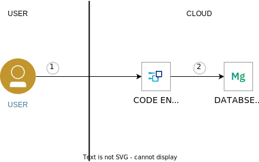
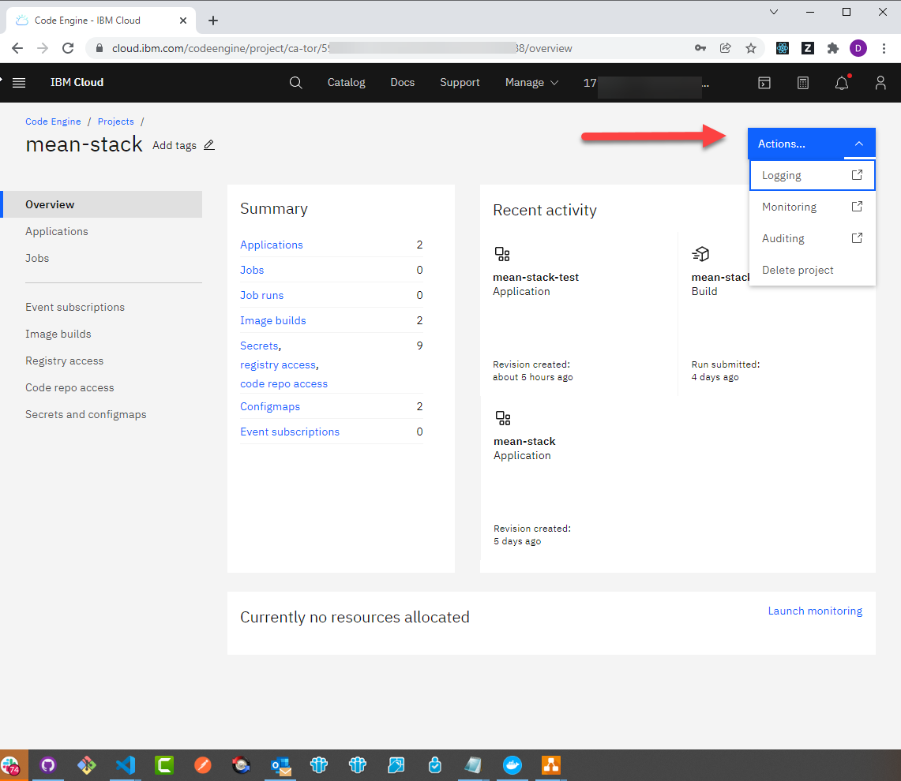

# Modern Web Application using MEAN stack

This is a basic boilerplate for the MEAN stack ([MongoDB](https://www.mongodb.org/), [Express](http://expressjs.com/), [AngularJS](https://angularjs.org/) and [Node.js](https://nodejs.org)) on [IBM Cloud](https://cloud.ibm.com).

This application uses [Databases for MongoDB](https://cloud.ibm.com/catalog/services/databases-for-mongodb) and [Code Engine](https://cloud.ibm.com/codeengine) on IBM Cloud.

The code and detailed steps are discussed in the [IBM Cloud solution tutorial](https://cloud.ibm.com/docs/solution-tutorials?topic=solution-tutorials-tutorials) titled [Modern web application using MEAN stack](https://cloud.ibm.com/docs/solution-tutorials?topic=solution-tutorials-mean-stack).



#### Features
- MVC project structure
- Create, edit and delete user accounts
- Authentication with username/password
- Protected routes that can only be accessed by authenticated users
- Bootstrap CSS framework
- HTTPS built-in if deployed to [IBM Cloud](#deploy-to-ibm-cloud)
- [Mongoose](https://github.com/Automattic/mongoose) for MongoDB interactions.
- [PassportJS](http://passportjs.org) for authentication, with over 300 authentication strategies to pick from.

## Application Requirements
- [Node.js & NPM](https://nodejs.org/en/download/)
- [IBM Cloud Databases for MongoDB](https://cloud.ibm.com/catalog/services/databases-for-mongodb)
- [Code Engine Command Line Tool](https://cloud.ibm.com/docs/codeengine?topic=codeengine-cli)

## Files & Folders

| File                               | Description                                                  |
| ---------------------------------- | ------------------------------------------------------------ |
| [**.env.example**](./.env.example) | Set custom [environment variables](https://en.wikipedia.org/wiki/Environment_variable) for your application. This is the proper way to store credentials and other sensitive values.
| [**server.js**](./server.js) | Main server file that the Node.js runtime uses. It contains all the server logic.
| [**/server**](./server) | Folder for files used by the Node.js server
| [/server/models/**user.model.js**](./server/models/user.model.js) | Model for storing users in MongoDB
| [**/public**](./public) | Folder for files delivered to users, such as html and css files
| [/public/js/**app.js**](./public/js/app.js) | Angular application for manipulating and rendering data in browser

## Application
- **MongoDB** stores user account information and persists sessions (so that a server crash does not log out all users.)
- **Express** functions Node.js middleware to handle all HTTP requests and routing.
- **Angular** handles HTML templating and data manipulation.
- **Node.js** is the runtime for the application.

There is also generous commenting throughout the application which helps explain critical parts of the application.

## Running locally

1. Clone or download this repo onto your machine.
1. Install [application requirements](#application-requirements) if not done so already.
1. Open application directory in your terminal and run `npm install`
1. If you don't have an account, [create a free one here](https://cloud.ibm.com).
1. Login to your account via the command line: `ibmcloud login`
1. Target your desired region  `ibmcloud target -r ca-tor`
1. Create the instance of Databases for MongoDB on IBM Cloud:  `ibmcloud resource service-instance-create mean-starter-mongodb databases-for-mongodb standard ca-tor`
1. Copy `.env.example` file to `.env`.  Edir `.env` to fill it the required values.  You can run `ibmcloud resource service-key-create mean-starter-mongodb-key --instance-name mean-starter-mongodb` to obtain the MONGODB_URL and CERTIFICATE_BASE64. Choose your own SESSION_SECRET.
1. Run `node server.js` to start your app
1. Open a browser to the link provided in the terminal prompt to view your app

> Note that the code assumes a secured connection to MongoDB using SSL and a certificate. This way you can run the app locally but connect to IBM Cloud Databases for MongoDB.

An alternative way of running locally is using the provided `Dockerfile`.
- Install docker on your machine and build the docker image
  ```
   docker build . -t mean-stack:v1.0.0
  ```
- Run the app locally
  ```
   docker run -p 8080:8080 --env-file .env -ti mean-stack:v1.0.0 
  ```

## Provision with Terraform
The steps of creating the resouces (database, code engine project, secret, application, ...) described in [Modern web application using MEAN stack](https://cloud.ibm.com/docs/solution-tutorials?topic=solution-tutorials-mean-stack) are captured in the terraform file [main.tf](main.tf).

[Getting started with solution tutorials](https://cloud.ibm.com/docs/solution-tutorials?topic=solution-tutorials-tutorials) has a description of how to get started with terraform on a workstation.


```
terraform init
terraform apply
```

## Provision with Schematics
Schematics is a cloud based Infrastructure as Code runner with cloud based state.  It leverages the Terraform configuration described in the previous section.

[Create a Schematics Workspace from this github repository](https://cloud.ibm.com/schematics/workspaces/create?repository=https://github.com/powellquiring/nodejs-MEAN-stack&terraform_version=terraform_v1.4)

The link above should have opened a schematics workspace in the create dialog with the github repository pre-configured and terraform 1.4 selected.  Change the **Workspace name**, **Resource group**, and **Location** as desired.  This will be the resource group of the workspace. The resource group of the resources created will be configured in schematics. Click **Create**.


## Contribute
Please create a pull request with your desired changes.

## Troubleshooting
The primary source of debugging information for your app running in the cloud are the logs. To see them, use the [Code Engine](https://cloud.ibm.com/codeengine/projects) web interface.



For more detailed information on troubleshooting your application, see the [Troubleshooting apps section](https://cloud.ibm.com/docs/codeengine?topic=codeengine-troubleshoot-apps) in the documentation.

## License
See [LICENSE.MD](https://github.com/powellquiring/nodejs-MEAN-stack/blob/master/LICENSE.md) for license information.
