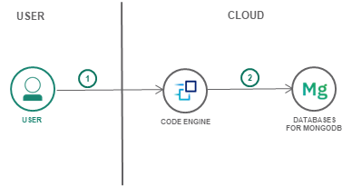
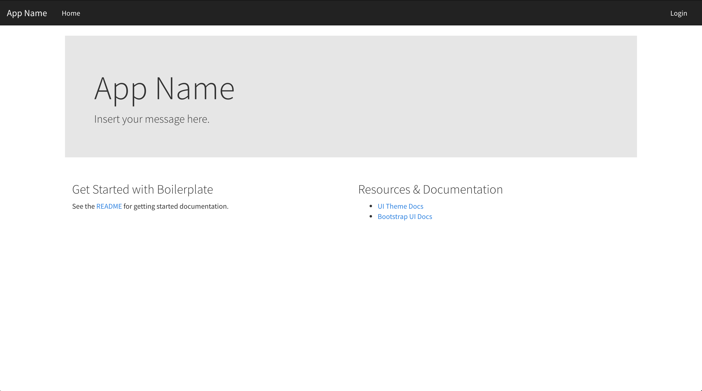

# Modern Web Application using MEAN stack

This is a basic boilerplate for the MEAN stack ([MongoDB](https://www.mongodb.org/), [Express](http://expressjs.com/), [AngularJS](https://angularjs.org/) and [Node.js](https://nodejs.org)) on [IBM Cloud](https://cloud.ibm.com).

This application uses the [IBM Cloud Databases for MongoDB service](https://cloud.ibm.com/catalog/services/databases-for-mongodb) and [Node.js runtime](https://cloud.ibm.com/docs/runtimes/nodejs?topic=Nodejs-nodejs_runtime) on IBM Cloud.

The code and detailed steps are discussed in the [IBM Cloud solution tutorial](https://cloud.ibm.com/docs/tutorials?topic=solution-tutorials-tutorials) titled [Modern web application using MEAN stack](https://cloud.ibm.com/docs/tutorials?topic=solution-tutorials-mean-stack).



#### Features
- MVC project structure
- Create, edit and delete user accounts
- Authentication with username/password
- Protected routes that can only be accessed by authenticated users
- Bootstrap CSS framework & [Cosmo theme](https://bootswatch.com/cosmo/)
- HTTPS built-in if deployed to [IBM Cloud](#deploy-to-ibm-cloud)
- [Mongoose](https://github.com/Automattic/mongoose) for MongoDB interactions.
- [PassportJS](http://passportjs.org) for authentication, with over 300 authentication strategies to pick from.

## Application Requirements
- [Node.js & NPM](https://nodejs.org/en/download/)
- [IBM Cloud Databases for MongoDB](https://cloud.ibm.com/catalog/services/databases-for-mongodb)
- [Cloud Foundry Command Line Tool](https://docs.cloudfoundry.org/devguide/installcf/)

## Getting Started
##### Run the application locally
1. Clone or download this repo onto your machine.
1. Install [application requirements](#application-requirements) if not done so already.
1. Open application directory in your terminal and run `npm install`
1. If you don't have an account, [create a free one here](https://cloud.ibm.com).
1. Login to your account via the command line: `ibmcloud login`
1. Target your account ORG and SPACE  `ibmcloud target --cf`
1. Create the instance of IBM Cloud Databases for MongoDB on IBM Cloud:  `ibmcloud cf create-service databases-for-mongodb standard mean-starter-mongodb`
1. Rename `.env.example` file to `.env` and run `ibmcloud cf service-key mean-starter-mongodb "Service credentials-1"` for MONGODB_URL and CERTIFICATE_BASE64. Choose your own SESSION_SECRET.
1. Run `node server.js` to start your app
1. Open a browser to the link provided in the terminal prompt to view your app

> Note that the code assumes a secured connection to MongoDB using SSL and a certificate. This way you can run the app locally but connect to IBM Cloud Databases for MongoDB.

An alternative way of running locally is using the provided `Dockerfile`.
- Install docker on your machine and build the docker image
  ```
   docker build . -t mean-stack:v1.0.0
  ```
- Run the app locally
  ```
   docker run -p 6020:6020 -ti mean-stack:v1.0.0
  ```

##### Deploy to IBM Cloud

Option 1 (launch this app directly from this repo):

[](https://cloud.ibm.com/devops/setup/deploy?repository=https://github.com/IBM-Cloud/nodejs-MEAN-stack)

Option 2 (deploy from your local machine):

1. Clone or download this repo onto your machine.
2. Open a terminal prompt to the directory of your application.
3. If you don't have an account, [create a free one here](https://cloud.ibm.com).
4. Login to your account via the command line: `ibmcloud login`
5. Target your account ORG and SPACE  `ibmcloud target --cf`
6. Create the instance of IBM Cloud Databases for MongoDB on IBM Cloud:  `ibmcloud cf create-service databases-for-mongodb standard mean-starter-mongodb`
7. Push your app to IBM Cloud with `ibmcloud cf push`
8. Done, the app should be looking like:

#### Problems or Questions?

Create a [GitHub issue](https://github.com/IBM-Cloud/nodejs-MEAN-stack/issues/new) for questions or problems occurs using this demo.

## Critical Files & Folders

| File                               | Description                                                  |
| ---------------------------------- | ------------------------------------------------------------ |
| [**manifest.yml**](./manifest.yml) | File that defines deployment paramaters. [More info here](http://docs.cloudfoundry.org/devguide/deploy-apps/manifest.html)
| [**.env.example**](./.env.example) | Set custom [environment variables](https://en.wikipedia.org/wiki/Environment_variable) for your application. This is the proper way to store credentials and other sensitive values.
| [**server.js**](./server.js) | Main server file that the Node.js runtime uses. It contains all the server logic.
| [**/server**](./server) | Folder for files used by the Node.js server
| [/server/models/**user.model.js**](./server/models/user.model.js) | Model for storing users in MongoDB
| [**/public**](./public) | Folder for files delivered to users, such as html and css files
| [/public/js/**app.js**](./public/js/app.js) | Angular application for manipulating and rendering data in browser


## Application
- **MongoDB** stores user account information and persists sessions (so that a server crash does not log out all users.)
- **Express** functions Node.js middleware to handle all HTTP requests and routing.
- **Angular** handles HTML templating and data manipulation.
- **Node.js** is the runtime for the application.

There is also generous commenting throughout the application which helps explain critical parts of the application.

## Contribute
Please create a pull request with your desired changes.

## Troubleshooting
The primary source of debugging information for your app is the logs. To see them, run the following Cloud Foundry command using the IBM Cloud CLI:

  ```
  $ ibmcloud cf logs <application-name> --recent
  ```

If you are not sure what your application name is, use this command to print your application name(s):

  ```
  $ ibmcloud cf apps
  ```

For more detailed information on troubleshooting your application, see the [Troubleshooting section](https://cloud.ibm.com/docs/cloud-foundry-public?topic=cloud-foundry-public-ts-cf-apps) in the documentation.

## License
See [LICENSE.MD](https://github.com/IBM-Cloud/nodejs-MEAN-stack/blob/master/LICENSE.md) for license information.
